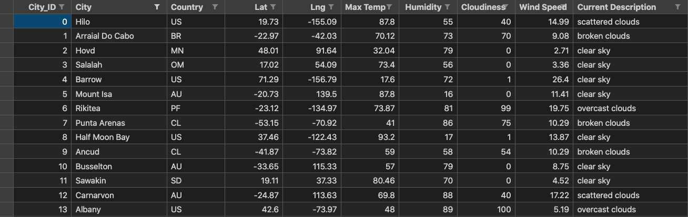
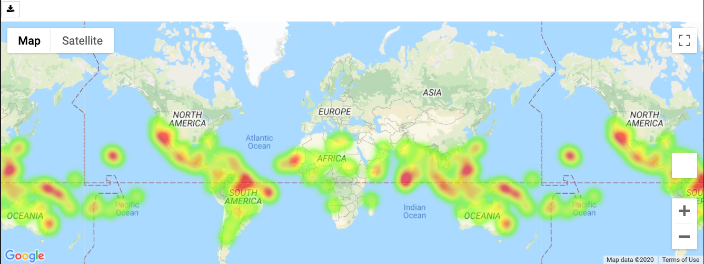
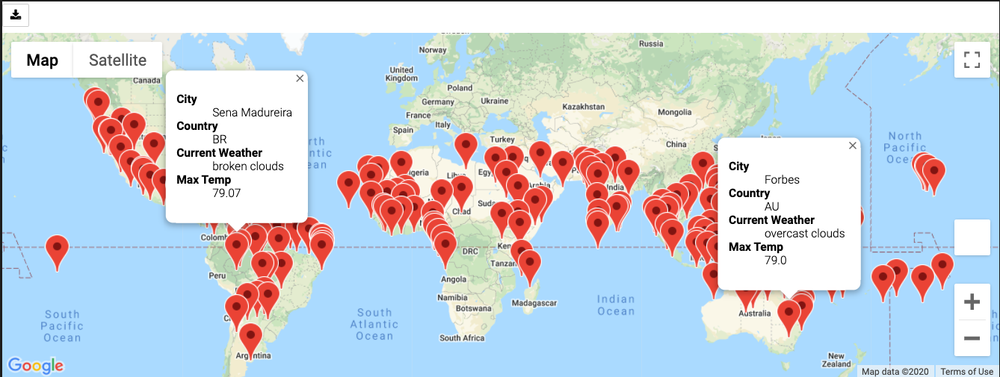
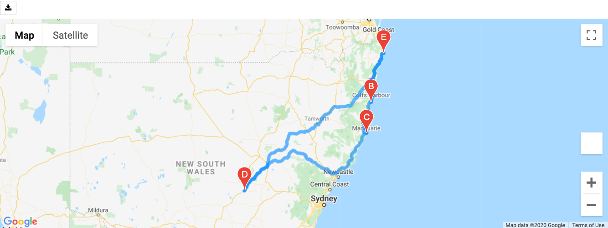
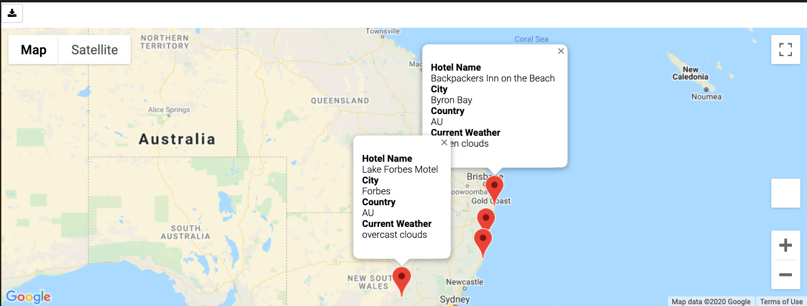

# World_Weather_Analysis

*****
*****

* By: Tyler Sojka
* October 2020
* API requests with python, pandas, OpenWeatherMap API, Google Maps Directions API, Google Maps And Places API, juypter notebooks

*****
*****

## Overview

The purpose of this project is to collect weather data from around the world using the OpenWeatherMap API. This data will then be used to recommend ideal hotels, based on client’s weather preferences. Along the way we will be generating the following visualizations:

* Create scatter plots of the weather data for the following comparisons:
  * Latitude versus temperature
  * Latitude versus humidity
  * Latitude versus cloudiness
  * Latitude versus wind speed
* Determine the correlations for the following weather data:
  * Latitude and temperature
  * Latitude and humidity
  * Latitude and cloudiness
  * Latitude and wind speed
* Create a series of heatmaps using the Google Maps and Places API that showcases the following:
  * Latitude and temperature
  * Latitude and humidity
  * Latitude and cloudiness
  * Latitude and wind speed
  
The project concludes with providing the client with a map of cities that match their weather preferences, allowing them to pick 4 of those countries, and providing them a detailed travel itinerary. The itinerary includes driving directions for a roundtrip journey starting and ending in their desired city, with 3 city stops along the way, as well as detailed weather information for each city.

## Methods

Collect the Data

* We will use the NumPy module to generate more than 2000 random latitudes and longitudes.
* Use the citipy module to list the nearest city to the latitudes and longitudes.
* Use the OpenWeatherMap API to request the current weather data from each unique city in your list.
* Parse the JSON data from the API request.
* Collect the following data from the JSON file and add it to a DataFrame:
  * City, country, and date
  * Latitude and longitude
  * Maximum temperature
  * Humidity
  * Cloudiness
  * Wind speed
  * Current conditions
  
Create a heatmap with pop-up markers that can display information on specific cities based on a customer's travel preferences. Complete these steps:

* Filter the Pandas DataFrame based on user inputs for a minimum and maximum temperature.
* Create a heatmap for the new DataFrame.
* Find a hotel from the cities' coordinates using Google's Maps and Places API, and Search Nearby feature.
* Store the name of the first hotel in the DataFrame.
* Add pop-up markers to the heatmap that display information about the city, current maximum temperature, and a hotel in the city.
* Using the Google Maps Directions API, you will create a travel route between the four cities as well as a marker layer map.

## Results

Here are a few selected images documenting the results of user choices, and desired analysis.

* Example database of cities found nearby the 2000 randomly generated latitude and longitudes and the gathered weather information:
    

* Example heat map of cities without markers:
    

* Heatmap of the cities after filtering for user weather input, max temperature 75-90:
    

* Generated directions between 4 selected cities in Australia, starting and ending in the same city:
    

* Information about selected cities in info-box city markers including a nearby hotel, city name and current weather:
    

